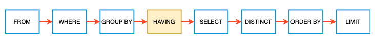

# MySQL Summary


## 0.0 Semantic



[from mysqltutorial](https://www.mysqltutorial.org/mysql-having.aspx)

* 1. order by

``` sql
GROUP BY m1.title
ORDER BY avg(rating) DESC, m1.title
```

* 2. UNION > ORDER BY (UNION takes only the last order by)

* 3. in subquery is time consuming most of the time.

## 1.0 Topics
### 1.1 Date
<table>
  <tr>
    <th>Action</th>
    <th>Method</th>
    <th>Question</th>
    <th> Solution </th
  </tr>
 <tr>
	  <td>break down time span</td>
	  <td> Recursion</td>
	  <td> <a href="https://leetcode.com/problems/total-sales-amount-by-year"> 1384. Total Sales Amount by Year</a> </td>
	  <td> 	<a href="1301-1700/1384Total_sales_amount_by_year.sql">Sol</a> </td>
  </tr>
 <tr>
	  <td>date shift </td>
	  <td> join + date_sub</td>
	  <td> <a href="https://leetcode.com/problems/game-play-analysis-v"> 1097. Game Play Analysis V</a> </td>
	  <td> 	<a href="1001-1300/1097.Game_play_analysi_V.sql">Sol</a> </td>
  </tr>
  <tr>
 	  <td>biggest window </td>
 	  <td>lead() + datediff()</td>
 	  <td> <a href="https://leetcode.com/problems/biggest-window-between-visits/"> 1709. Biggest Window Between Visits</a> </td>
 	  <td> 	<a href="1701-2000/1709.Biggest_window_between_visits.sql">Sol</a> </td>
  </tr>

  <tr>
	  <td>find date overlap </td>
	  <td>join+where</td>
	  <td> <a href="https://leetcode.com/problems/leetflex-banned-accounts/"> 1747. Leetflex Banned Accounts</a> </td>
	  <td> 	<a href="1701-2000/1747.Leeflex_banned_accounts.sql">Sol</a> </td>
   </tr>

  </table>

+ last_day("2011-03-03") ==> "2011-03-31"
+ STR_TO_DATE(string, format)
  + % e numeric DAY 0-31
  + % d numerica DAY 01-31
  + % c numeric MONTH 0-12
  + % W full day name
  + % a abbr day name
  + % M month name
+ "2020-01-01" +interval 1 day

&nbsp;

### 1.2 Text
<table>
  <tr>
    <th>Action</th>
    <th>Method</th>
    <th>Question</th>
    <th> Solution </th
  </tr>
 <tr>
	  <td>exist a pattern</td>
	  <td> Like/REGEXP_LIKE</td>
	  <td> <a href="https://leetcode.com/problems/patients-with-a-condition"> 1527. Patients With a Condition</a> </td>
	  <td> 	<a href="1301-1700/1527.Patients_with_a_condition.sql">Sol</a> </td>
 </tr>
 <tr>
	  <td>group 2+ strings </td>
	  <td> group_concat()</td>
	  <td> <a href="https://leetcode.com/problems/group-sold-products-by-the-date/"> 1484. Group Sold Products By The Date</a> </td>
	  <td> 	<a href="1301-1700/1484.Group_sold_by_products_by_the_date.sql">Sol</a> </td>
 </tr>
 <tr>
	  <td>character length (emoji/signs) </td>
	  <td>lead() + datediff()</td>
	  <td> <a href="https://leetcode.com/problems/invalid-tweets/"> 1683. Invalid Tweets</a> </td>
	  <td> 	<a href="1301-1700/1683.Invalid_tweets.sql">Sol</a> </td>
 </tr>
</table>

+ Like: case sensitive
  + "%ed": end with "ed"; time consuming
  + _: matches a single character
+ regexp:
  + "ed": contains "ed"; like "ed" ==> is "ed"
  + REGEXP_LIKE('Cat', '^ca', 'c'): 'c'==> case sensitive; "i"==> case insensitive
  + "\\\": escape
+ soundex(): soundex value of a string

&nbsp;

### 1.3 Break & merge columns/rows

<table>
  <tr>
    <th>Action</th>
    <th>Method</th>
    <th>Question</th>
    <th> Solution </th
  </tr>
 <tr>
	  <td rowspan="3" align="center">break columns</td>
	  <td rowspan="2" align="center">if()</td>
    <td> <a href="https://leetcode.com/problems/monthly-transactions-ii"> 1205. Monthly Transactions II</a> </td>
    <td> 	<a href="1001-1300/1205.Monthly_transction_ii.sql">Sol</a> </td>
 </tr>
 <tr>
   <td> <a href="https://leetcode.com/problems/ads-performance"> 1322. Ads Performance</a> </td>
   <td> 	<a href="1301-1700/1322.Ads_performance.sql">Sol</a> </td>
 </tr>
 <tr>
	  <td align="center" >time span: recursive </td>
	  <td> <a href="https://leetcode.com/problems/total-sales-amount-by-year"> 1384. Total Sales Amount by Year</a> </td>
	  <td> 	<a href="1301-1700/1384Total_sales_amount_by_year.sql">Sol</a> </td>
 </tr>
  <tr>
	  <td rowspan="3" align="center">merge/stack columns</td>
	  <td rowspan="3" align="center"> union/union all</td>
	<td> <a href="https://leetcode.com/problems/consecutive-available-seats"> 602. Friend Requests II: Who Has the Most Friends</a> </td>
	  <td> 	<a href="100-1000/602.Friend_request_ii_who_has_the_most_freiends.sql">Sol</a> </td>
 </tr>
 <tr>
 	  <td> <a href="https://leetcode.com/problems/grand-slam-titles"> 1783. Grand Slam Titles</a> </td>
	  <td> 	<a href="1701-2000/1783.Grand_Slam_Titles.sql">Sol</a> </td>
 </tr>
 <tr>
 	  <td> <a href="https://leetcode.com/problems/rearrange-products-table"> 1795.  Rearrange Products Table</a>
 </td>
	  <td> 	<a href="1701-2000/1795.Rearrange_products_table.sql">Sol</a> </td>
  <tr>
	  <td rowspan="5" align="center">combine rows/pivot</td>
	  <td align="center"> as+union all+group by</td>
	<td> <a href="https://leetcode.com/problems/league-statistics"> 1841. League Statistics</a> </td>
	  <td> 	<a href="1701-2000/1841.League_statistics.sql">Sol</a> </td>
 </tr>
  <tr>
  <td rowspan="2" align="center">if + max + group by</td>
 	  <td> <a href="https://leetcode.com/problems/products-price-for-each-store"> 1777. Product's Price for Each Store</a>
 	<td><a href="1701-2000/1777.Product_price_for_each_store.sql">Sol </a></td>
 </tr>
 <tr>
 	  <td> <a href="https://www.hackerrank.com/challenges/occupations/problem"> Occupation</a>
 	<td><a href="hr1-100/occupation_pivot.sql">Sol </a></td>
 </tr>
  <tr>
	  <td align="center"> sum(case when)</td>
 	  <td> <a href="https://leetcode.com/problems/apples-oranges/"> 1445. Apples & Oranges</a>
 	<td><a href="1301-1700/1445.Apples_oranges.sql">Sol </a></td>
 </tr>
   <tr>
	  <td align="center"> row_number()+case when +group by</td>
 	  <td> <a href="https://leetcode.com/problems/students-report-by-geography"> 618. Students Report By Geography</a>
 	<td><a href="100-1000/618.Students_report_by_geography.sql">Sol </a></td>
 </tr>

</table>

&nbsp;

### 1.4 Extract information from each group by condition

<table>
<tr>
  <th>Action</th>
  <th>Method</th>
  <th>Question</th>
  <th> Solution </th
</tr>
<tr>
  <td rowspan="2" align="center">maximum</td>
  <td align="center">max+partition by</td>
  <td> <a href="https://leetcode.com/problems/project-employees-iii"> 1077. Project Employees III</a> </td>
  <td> 	<a href="1001-1300/1077.Project_employee_ii.sql">Sol</a> </td>
</tr>
<tr>
 <td align="center">count()>=all()</td>
  <td> <a href="https://leetcode.com/problems/project-employees-ii"> 1076. Project Employees II</a> </td>
  <td> 	<a href="1001-1300/1076.Project_employee_ii.sql">Sol</a> </td>
</tr>
<tr>
  <td rowspan=2 align="center" >most recent </td>
  <td rowspan=2 align="center" >dense_rank()</td>
  <td> <a href="https://leetcode.com/problems/the-most-recent-orders-for-each-product"> 1549. The Most Recent Orders for Each Product</a> </td>
  <td> 	<a href="1301-1700/1549.The_most_recent_orders_for_each_product.sql">Sol</a> </td>
</tr>
<tr>
  <td> <a href="https://leetcode.com/problems/the-most-recent-three-orders"> 1532. The Most Recent Three Orders</a> </td>
  <td> 	<a href="1301-1700/1532.The_most_recent_three_orders.sql">Sol</a> </td>
</tr>
<tr>
  <td rowspan="3" align="center">median</td>
  <td align="center"> restore full list (recursive +row_number+between max/2 and max/2+1)</td>
<td> <a href="https://leetcode.com/problems/find-median-given-frequency-of-numbers"> 571. Find Median Given Frequency of Numbers</a> </td>
  <td> 	<a href="100-1000/571.Find_median_given_frequency_of_numbers.sql">Sol</a> </td>
</tr>
<tr>
  <td align="center"> frequency table (create intervals + between +avg)</td>
<td> <a href="https://leetcode.com/problems/find-median-given-frequency-of-numbers"> 571. Find Median Given Frequency of Numbers</a> </td>
  <td> 	<a href="100-1000/571.Find_median_given_frequency_of_numbers.sql">Sol</a> </td>
</tr>
<tr>
  <td align="center"> desc, asc, where </td>
<td> <a href="https://leetcode.com/problems/median-employee-salary/"> 569. Median Employee Salary</a> </td>
  <td> 	<a href="100-1000/569.Median_employee_salary.sql">Sol</a> </td>
</tr>
<tr>
 <td rowspan=3 align="center">running sum</td>
 <td rowspan=2 align="center">sum()+ window function order by</td>
<td ><a href="https://leetcode.com/problems/running-total-for-different-genders/">1308. Running Total for Different Genders</a></td>
 <td> <a href="1301-1700/1308.Running_total_for_different_genders.sql">Sol</a></td>
</tr>
<tr>
<td ><a href="https://leetcode.com/problems/restaurant-growth/">1321. Restaurant Growth</a></td>
 <td> <a href="1301-1700/1321.Restaurant_growth.sql">Sol</a></td>
</tr>
<tr>
<td align="center">join on date>=col+group by </td>
<td ><a href="https://leetcode.com/problems/game-play-analysis-iii/">534. Game Play Analysis III</a></td>
 <td> <a href="100-1000/534.Game_play_analysis_iii.sql">Sol</a></td>
</tr>
<tr>
 <td rowspan=2 align="center">in a range exclusively</td>
 <td align="center">in and not in</td>
<td ><a href="https://leetcode.com/problems/sales-analysis-iii/">1084. Sales Analysis III</a></td>
 <td> <a href="1001-1300/1084.Sales_analysis_iii.sql">Sol</a></td>
</tr>
<tr>
 <td align="center">group by + having min>= AND max<=</td>
<td ><a href="https://leetcode.com/problems/sales-analysis-iii/">1084. Sales Analysis III</a></td>
 <td> <a href="1001-1300/1084.Sales_analysis_iii.sql">Sol</a></td>
</tr>

</table>

&nbsp;

### 1.5 Full List

<table>
  <tr>
    <th>Context</th>
    <th>Method</th>
    <th>Question</th>
    <th> Solution </th
  </tr>
 <tr>
	  <td rowspan=5 align="center">including 0 case</td>
	  <td align="center">not in</td>
	  <td> <a href="https://leetcode.com/problems/unpopular-books/"> 1098. Unpopular Books</a> </td>
	  <td> 	<a href="1001-1300/1098.Unpopular_books.sql">Sol</a> </td>
 </tr>
  <tr>
	  <td align="center">left join + if/case when</td>
	  <td> <a href="https://leetcode.com/problems/market-analysis-i/"> 1158. Market Analysis I</a> </td>
	  <td> 	<a href="1001-1300/1158.Market_analysis_i.sql">Sol</a> </td>
 </tr>
   <tr>
	  <td align="center">left join + filter in ON</td>
	  <td> <a href="https://leetcode.com/problems/unpopular-books/"> 1098. Unpopular Books</a> </td>
	  <td> 	<a href="1001-1300/1098.Unpopular_books.sql">Sol</a> </td>
 </tr>
 <tr>
	  <td align="center">cross join + left join</td>
	  <td> <a href="https://leetcode.com/problems/students-and-examinations/"> 1280. Students and Examinations</a> </td>
	  <td> 	<a href="1001-1300/1280.Students_and_examinations.sql">Sol</a> </td>
 </tr>
  <tr>
	  <td align="center">recursive id+1/id-1</td>
	  <td> <a href="https://leetcode.com/problems/find-the-subtasks-that-did-not-execute/"> 1767. Find the Subtasks That Did Not Execute</a> </td>
	  <td> 	<a href="1701-2000/1767.Find_the_subtask_that_did_not_execute.sql">Sol</a> </td>
 </tr>
  <tr>
	  <td rowspan=4 align="center">filter</td>
	  <td rowspan=3 align="center">union all + where (exists)</td>
	  <td> <a href="https://leetcode.com/problems/count-salary-categories/"> 1907. Count Salary Categories</a> </td>
	  <td> 	<a href="1701-2000/1907.Count_salary_categories.sql">Sol</a> </td>
 </tr>
 <tr>
	  <td> <a href="https://leetcode.com/problems/leetcodify-friends-recommendations/"> 1917. Leetcodify Friends Recommendations</a> </td>
	  <td> 	<a href="1701-2000/1917.Leetcodify_friends_recommendations.sql">Sol</a> </td>
 </tr>
 <tr>
	  <td> <a href="https://leetcode.com/problems/leetcodify-similar-friends/"> 1919. Leetcodify Similar Friends</a> </td>
	  <td> 	<a href="1701-2000/1919.Leetcodify_similar_friends.sql">Sol</a> </td>
 </tr>
 <tr>
	 <td>union all + left join</td>
	  <td> <a href="https://leetcode.com/problems/page-recommendations-ii/"> 1892. Page Recommendations II</a> </td>
	  <td> 	<a href="1701-2000/1892.Page_recommendation_ii.sql">Sol</a> </td>
 </tr>
 <tr>
	  <td align="center">with cumsum (date range)</td>
	  <td align="center">recursive+ case when + group by</td>
	  <td> <a href="https://leetcode.com/problems/hopper-company-queries-ii/"> 1645. Hopper Company Queries II</a> </td>
	  <td> 	<a href="1301-1700/1645.Hopper_company_queries_ii.sql">Sol</a> </td>
 </tr>
 <table>

&nbsp;

### 1.6 Consecutive values

<table>
  <tr>
    <th>Action</th>
    <th>Method</th>
    <th>Question</th>
    <th> Solution </th
  </tr>
 <tr>
	  <td rowspan=3 align="center">consecutive date</td>
	  <td align="center">join + where</td>
	  <td> <a href="https://leetcode.com/problems/game-play-analysis-iv"> 550. Game Play Analysis IV</a> </td>
	  <td> 	<a href="100-1000/550.Game_play_analysis_IV.sql">Sol</a> </td>
 </tr>
  <tr>
	  <td rowspan=2 align="center">date_sub+row_number+group by</td>
	  <td> <a href="https://leetcode.com/problems/active-users"> 1454. Active Users</a> </td>
	  <td> 	<a href="1301-1700/1454.Active_users.sql">Sol</a> </td>
 </tr>
   <tr>
	  <td> <a href="https://leetcode.com/problems/suspicious-bank-accounts/"> 1843. Suspicious Bank Accounts</a> </td>
	  <td> 	<a href="1701-2000/1843.Suspicious_bank_accounts.sql">Sol</a> </td>
 </tr>
  <tr>
	  <td rowspan=2 align="center">consecutive id</td>
	  <td align="center">id-row_number()+group by</td>
	  <td> <a href="https://leetcode.com/problems/find-interview-candidates"> 1811. Find Interview Candidates</a> </td>
	  <td> 	<a href="1701-2000/1811.Find_interview_candidates.sql">Sol</a> </td>
 </tr>
 <tr>
  <td align="center">lead()/lag() </td>
  <td> <a href="https://leetcode.com/problems/consecutive-numbers/"> 180. Consecutive Numbers</a> </td>
  <td> 	<a href="100-1000/180.Consecutive_numbers.sql">Sol</a> </td>
</tr>
</table>

&nbsp;

## 2.0 Concepts

### 2.1 Recursive
* break one row [1384](1301-1700/1384Total_sales_amount_by_year.sql)

* making a full list [1336](1301-1700/1336.Number_of_trans.sql), [1613](1301-1700/1613.Find_the_missing_ids.sql),[1127](1001-1300/1127.User_purcahse_platform.sql)

### 2.2 Window Function

* count frequency [534](100-1000/534Game_play_analysis.sql),

* extract by order
  + second most recent [1369](1301-1700/1369.Get_the_second_most_recent_activity.sql)
  + Highest grade for each student [1112](1001-1300/1112Highest_grade_for_each_student.sql)

### 2.3 Array [585](100-1000/585.Investment_in_2016.sql)

### 2.4 Boolean [1440](1301-1700/1440.Evaluate_boolean_expression.sql)

### 2.5 Special Topics
  + where: filter rows not groups
    + != value not return null becasue DB doesn't know if they match
    + not in vs not exist : [1978](1701-2000/1978.Employees_whose_manager_left_the_company.sql)
    + () > AND > OR (don't rely on default order, use parentheses)
    + IN is faster than OR
    + NOT + in/exists/between and
  + greatest()
  + convert(v,type)
  + ceil()
